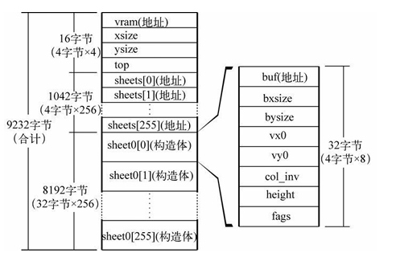

# 30天自制操作系统---第十天

## 1. 内存处理
* 编写一些总是以0x1000字节为单位进行内存分配和释放的函数

* 使用向上舍入

        i = (i + 0xfff) & 0xfffff000;

* **不管采用以上哪种方法，在以2^n（n>0）以外的数为单位进行向下舍入和向上舍入处理时，都必须要使用除法命令，而它恰恰是CPU最不好处理的命令之一，所以计算过程要花费较长的时间**

## 2. 叠加处理（重点）
* 引入图层(sheet)的概念(让我不禁回想起了高中学习的PS)

        struct SHEET {
            unsigned char *buf;
            int bxsize, bysize, vx0, vy0, col_inv, height, flags;
        }

* 定义管理图层的结构:

         struct SHTCTL {
            unsigned char *vram;
            int xsize, ysize, top;
            struct SHEET *sheets[MAX_SHEETS];
            struct SHEET sheets0[MAX_SHEETS];
        };

    

* 之后就是实现初始化管理图层、图层的显示隐藏、移动、刷新等操作

* 为了加快叠加处理的速度，将原本的全体刷新改为了部分刷新

## 收获
### 1. 懂得了2^n向上舍入的便捷写法
* **i = (i + 0xfff) & 0xfffff000;**

### 收获满满的一天！