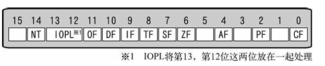

# 30天自制操作系统---第四天

## 1. 绘制矩阵（没错今天就这么一点内容）
* 首先要在VRAM（显卡内存）中写入每个像素的颜色值（利用C语言的指针实现）

* 设定矩形的颜色，自己设定调色板

* 在设定调色板时，需要保存和设定标志寄存器的值

* 最后能够成功画出矩形后，使用作者的一系列画矩形的代码，画出了一个类似早期Windows的界面（**成就感拉满**）

## 收获
### 1. 理解C语言的指针（巨大收获！）
* 下面的代码中对于p来说，比起指针这个称呼我觉得叫地址变量更贴切

* p中存放的其实时内存地址，*p等价与汇编语言中的[p]，\*起到的作用是取该内存地址的那块内存，然后就可以对这块内存进行读写操作。(**\*p并不是什么变量**)

* 定义指针时，前面char类型或int类型，或者自定义的结构体，就是告诉CPU从p内存地址开始连续用足够的内存去存储该类型的数据。

* 指定了char类型说明是以该内存地址一个字节一个字节地存储数据

        char *p;
        p = 0x0xa0000;
        *p = 0x0f;

* 还有指针有意思的用法，读者表示很新奇！

        p = (char *) 0xa0000; /*给地址变量赋值*/
        for (i = 0; i <= 0xffff; i++) {
            /*循环内部*/
        }

* 在这个循环内部以下的写法都能达到相同的效果

        *(p + i) = i & 0x0f; //写法1
        p[i] = i & 0x0f; //写法2
        i[p] = i & 0x0f; //写法3，这个写法太新奇了

* 作者也由这几个写法介绍了一下“数组”

* 书中的原话:**写得不好的C语言教科书里，往往会说p[i]是数组p的第i个元素**，~~那么读者读过的很多C语言资料都被变相地🐎了~~

* 由于加法运算是可交换的，那么 __*(p + i) <=> *(i + p)__， 所以 p[i] <=> i[p]的。从逻辑上这么推导没问题，实际程序也能正常运行。

* 那么p[i]和i[p]都是一种缩写，与数组无关。

### 2. 了解CPU与设备通信
* 主要是通过IN指令和OUT指令
* 这里的IN指令和OUT指令都是相对与CPU来说的
* OUT--向设备发送电信号
* IN--从设备读取电信号
* 区别不同的设备用**端口(port)**，不同的设备有不同的端口号
* 作者对端口的解释很有意思，建议看看原文

### 3. 了解标志寄存器（EFLAGS）
* 该寄存器的结构如下：

    

* 是存储进位标志和中断标志等标志的寄存器
* 目前为止，读者只清楚IF和CF标志，别的后面学到再补充吧
* CF是之前用过的进位标志，可以通过JC和JNC指令判断是否位零
* IF是中断标志，1代表允许中断，0代表忽略中断
* IF没有相应的指令能够读取判断
* 由于我们在定义调色板的时候要忽略中断，所以要把IF置0，调用完成后又需要回复IF的值
* 涉及到EFLAGS的读取和写入，EFLAGS不能直接读取，需要通过栈来进行操作
* 读写的指令只有PUSHFD和POPFD
* 取EFLAGS的数据指令如下：

        PUSHFD              ; 指 PUSH EFLAGS
        POP     
        EAX

* 存EFLAGS的数据指令如下：
        MOV     EAX,[ESP+4]
        PUSH    EAX
        POPFD               ; 指 POP EFLAGS        

### 又是收获满满的一天！