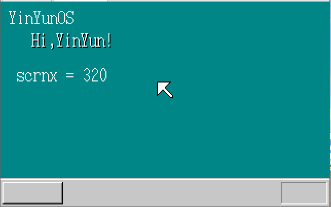

# 30天自制操作系统---第五天

## 1. 显示字符串和显示鼠标指针
* 本质上与昨天画矩形的做法没什么区别

* 其实就是在一个矩形的范围里，在指定的像素点显示相应的颜色

* 为了显示字符方便，导入了作者OSASK系统的字体

* 最后能够成功显示字符串以及图标，效果如下：（**成就感又拉满辣**）

    

## 2. 初始化GDT和LDT（**重点**）
* 首先要了解GDT和LDT是神马东东，但是作者目前介绍的比较浅且少，这两个概念我放在收获中。

* 需要在内存中分配一块地方去存储这两个东西。

* 将0x270000～0x27ffff设为GDT

* 将0x26f800～0x26ffff设为IDT

* 然后就是愉快的~~抄袭~~学习作者的代码（顺便提一嘴，作者的代码简直是强迫症患者的福音，太舒服了）

* 最后程序没有报错，虚拟机成功运行

## 收获
### 1. 使用结构体指针
* 由于读者在学习数据结构课程的时候用过结构体和指针，但是确实是只会大概的用法，没有确切的理解，今天通过这本书进一步理解和掌握相关用法。

* 设置结构体指针p，昨天学过这个p中存放的是指针。

* 取地址中的内容时，可以一次取一整个结构体大小的数据块。

* 当取结构体中的某个数据时,可以按照下面这种写法：

        int x = (*binfo).scrnx;
* （个人理解）上面等式后的操作是先取一个结构体，然后用'.'取访问其中的属性。

* 上面这个代码的箭头简略写法如下：

        int x = binfo->scrnx; // 感觉很直观！

### 2. 对GDT和IDT有初步了解
* GDT是“global（segment）descriptor table”的缩写--**全局段号记录表**
* IDT是“interrupt descriptor table”的缩写--**中断记录表**
* 这两个是与CPU有关的设定，为了使操作系统能够使用32位模式
* 内存需要分段--需要段寄存器--与16位模式不同，段寄存器中存放段号，然后对应段
* 表示一个段需要以下信息（8字节存储）：
    * 段的大小
    * 段的起始地址
    * 段的管理属性
* 段寄存器只有16位，存储不了，只能存储段号，然后用对应的方式寻找段。低三位还用不了，只能处理只有位于0~8191的区域
* GDT就是8192 * 8B = 64KB这么多数据
* IDT主要为了实现中断功能而产生的
* **中断功能**是指当CPU遇到外部状况变化，或者是内部偶然发生某些错误时，会临时切换过去处理这种突发事件
* 发生中断后，CPU暂停当前正在处理的任务，去执行中断程序（调用事先
设定好的函数）
* 得益于中断机制，CPU能够集中精力处理任务
* IDT记录了0～255的中断号码与调用函数的对应关系

### 双(又又)是收获满满的一天！