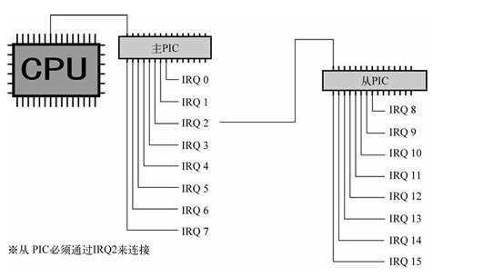

# 30天自制操作系统---第六天

## 1. 一些整理代码的工作
* 分割源文件、整理Makefile和整理头文件

* 做这些工作的好处很多，比如说~~很酷~~易修改

* 将原来的bootpack.c分割为bootpack.c、graphic.c以及dsctbl.c

* 将一些结构体的定义以及函数的声明放到一个单独的bootpack.h文件中

## 2. 初始化PIC和中断程序的制作（重点）
* PIC是“programmable interrupt controller”的缩写--**可编程中断控制器**

* PIC是将8个中断信号集合成一个中断信号的装置

* 主要的工作是对PIC的寄存器做相关的设定

* C语言函数和汇编函数配合完成中断程序

* 将中断处理注册在IDT中

* 最后程序没有报错，虚拟机成功运行

## 收获
### 1. 近一步了解GDT和段结构
* 需要赋值GDTR(48位寄存器)，赋值指令--LGDT:

        LGDT    [ESP+6]

* 低16位是段上限=GDT有效字节数-1

* 高32位是GDT的开始地址

* IDTR的结构和GDTR的结构基本一致

* 8个字节存储段的信息

| 属性名       | 大小 | 存储内容                                | 
| :---------:  | :-: | :---------:                             |
| base_low     | 2B  |  基址的前2字节                           |
| base_mid     | 1B  |  基址的第3字节                           |
| base_high    | 1B  |  基址的第4字节                           |
| limit_low    | 2B  |  上限的前2字节                           |
| limit_high   | 1B  |  低4位存上限的16-19位,高4位存属性的12-15位|
| access_right | 1B  |  存属性的第1个字节                       |

* 地址分段的原因:兼容80286时代的程序。

* 上限只有20位导致最大也就1MB，解决方案:属性中有Gbit标志位，为1时limit的单位解释成页(4KB)。最终段最大能指定4GB。

* 段属性又名段的访问权属性，结构:xxxx0000xxxxxxxx

* 高4位(80286时代不存在)--“GD00”，G->Gbit位，D->段的模式(1-32位，0-16位)

* 低8位(80286时代存在):
  * 00000000（0x00）：未使用的记录表（descriptor table）。
  * 10010010（0x92）：系统专用，可读写的段。不可执行。
  * 10011010（0x9a）：系统专用，可执行的段。可读不可写。
  * 11110010（0xf2）：应用程序用，可读写的段。不可执行。
  * 11111010（0xfa）：应用程序用，可执行的段。可读不可写。

### 2. 初步了解PIC
* IRQ是“interrupt request”的缩写--**中断信号**

* 中断信号设计成15个，两个PIC，**主PIC**和**从PIC**(根据是否与CPU相连)

  

* PIC的寄存器IMR(8位)--“interrupt mask register”--**中断屏蔽寄存器**

* 某一位设定为1则对应的IRQ信号类屏蔽

* ICW(有4个,每个8位)是“initial control word”的缩写--**初始化控制数据**

* ICW1和ICW4与PIC主板配线方式、中断信号的电气特性等有关，固定值

* ICW3是有关主—从连接的设定，第几号IRQ与从PIC相连，是用8位来设定的

* ICW2，决定了IRQ以哪一号中断通知CPU

* CPU受理中断后命令PIC发送两个字节的数据，发送来的数据是“0xcd 0x??”，由于设计原因，会当作机器语言执行，而“0xcd”就是调用BIOS的INT指令。

### 叒(又又又)是收获满满的一天！