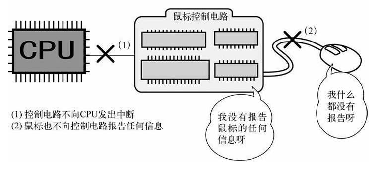

# 30天自制操作系统---第七天

## 1. 获取按键编码以及设计FIFO缓存区
* 获取按键编码主要是修改inthandler21函数，下面是关键代码:

        unsigned char data;
        io_out8(PIC0_OCW2, 0x61);   // 通知PIC"IRQ-01已经受理完毕" 
        data = io_in8(PORT_KEYDAT); // 从相应端口获取编码数据

* 定义一个名为FIFO8的结构体:

        struct FIFO8 {
            unsigned char *buf;
            int pre, next, size, free, flags;
            /* pre和next分别指向队首和队尾
               size是队列大小
               free是空闲的数据量
               flags是队列相关的标志
            */
        };

* 实现FIFO队列的相关操作:
    * 初始化
    * 读数据
    * 存数据
    * 获取队列中数据的数量

* 设计FIFO队列主要使用到了循环的思想

## 2. 获取鼠标数据
* Day6中写了对鼠标的中断处理程序

* 如果要接收鼠标的数据，需要使**鼠标控制电路**和**鼠标**有效:

        io_out8(PORT_KEYCMD, KEYCMD_WRITE_MODE);
        io_out8(PORT_KEYDAT, KBC_MODE); /* 初始化键盘控制电路 */
        io_out8(PORT_KEYCMD, KEYCMD_SENDTO_MOUSE);
        io_out8(PORT_KEYDAT, MOUSECMD_ENABLE); /* 激活鼠标 */

* 鼠标能够顺利发送数据后，采用类似键盘的方法接收鼠标的数据

## 收获
### 1. 了解一些使用硬件相关的知识
* 处理中断时要将“0x60+IRQ号码”输出给OCW2，使PIC继续监视相应IRQ中断

* 编号为**0x0060**(PORT_KEYDAT)的设备是键盘

* 按下和松开键盘某个按键都会返回值

* 鼠标属于“新兴”设备

* 主板上有鼠标的电路--不激活就不会产生中断(1)

* 鼠标不激活不会产生数据(2)

    

* 键盘控制电路中含有鼠标控制电路

* 如果键盘控制电路可以接受CPU指令了，CPU从设备号码0x0064处所读取的数据的倒数第二位（从低位开始数的第二位）应该是0。

* 模式设定的指令是0x60，利用鼠标模式的模式号码是0x47

* 往键盘控制电路发送指令0xd4，下一个数据就会自动发送给鼠标，根据这一特性来发送激活鼠标的指令

* 鼠标收到激活指令后会发送答复信息0xfa

### 叕(又又又又)是收获满满的一天！