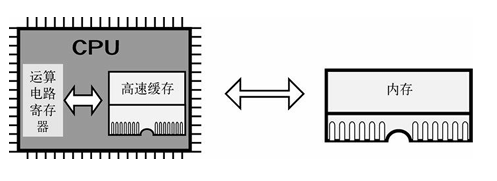

# 30天自制操作系统---第九天

## 1. 内存检查
* 检查CPU是486以上还是386(EFLAGS寄存器的第18位的AC标志位)

* 让486以后的CPU的高速缓存(cache)功能无效(对CR0寄存器的某一标志位进行操作)

* 内存检查的具体代码:

         unsigned int memtest_sub(unsigned int start, unsigned int end) {
            unsigned int i, *p, old, pat0 = 0xaa55aa55, pat1 = 0x55aa55aa;
            for (i = start; i <= end; i += 0x1000) {
                p = (unsigned int *) (i + 0xffc);
                old = *p;           
                /* 先记住修改前的值 */
                *p = pat0;          
                /* 试写 */
                *p ^= 0xffffffff;   /* 反转 */
                if (*p != pat1) {   /* 检查反转结果 */
        not_memory:
                *p = old;
                break;
                }
                *p ^= 0xffffffff;   /* 再次反转 */
                if (*p != pat0) {   /* 检查值是否恢复 */
                goto not_memory;
                }
                *p = old;           
                /* 恢复为修改前的值 */
            }
            return i;
        }

## 2. 内存管理（重点）
* 采用列表管理的方法

* 定义与内存管理相关的结构体:

        struct FREEINFO {   
            /* 可用状况 */
            unsigned int addr, size;
        };
        struct MEMMAN {     
            /* 内存管理 */
            int frees;
            struct FREEINFO free[1000];
        };

* 编写关于内存管理初始化、内存申请和内存释放的函数。

## 收获
### 1. 了解高速缓存(cache)
* 每次访问内存，都要将所访问的地址和内容存入到高速缓存里

* 往内存里写入数据时也一样，首先更新高速缓存的信息，然后再写入内存

* 观察机器语言的流程会发现，9成以上的时间耗费在循环上。

* 386的CPU没有缓存，486的缓存只有8-16KB，但两者的性能就差了6倍以上

    

### 2. 学习如何进行内存管理
* 利用列表管理内存

* 初始化内存管理

* 申请内存

* 释放内存

### 收获满满的一天！